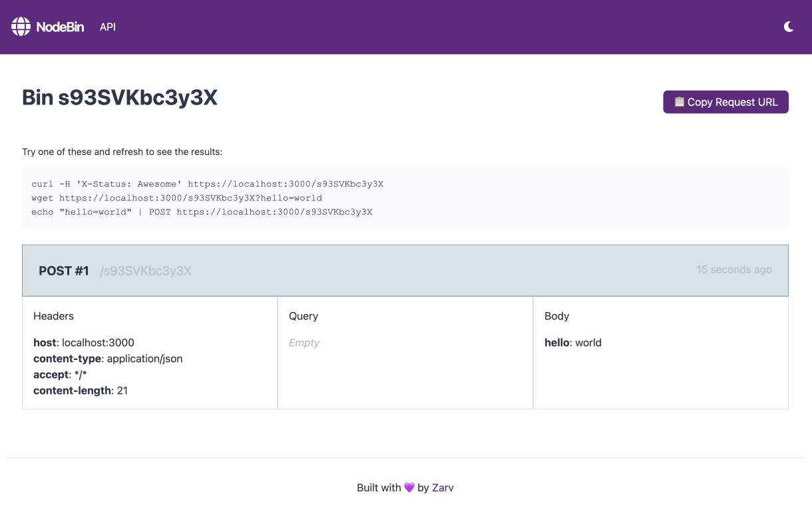

<p align="center">
  <h1 align="center">📬 NodeBin</h1>
</p>

<p align="center">
  Collect and inspect HTTP requests in real time — perfect for testing webhooks, API clients, and more.
</p>

<p align="center">
   <a title="Docker Pulls" href="https://hub.docker.com/r/costajoao/nodebin"></a> <a title="MIT License" href="LICENSE"></a>
  <br />
  <br />
</p>

**NodeBin** is a lightweight, self-hosted HTTP request collector — ideal for testing webhooks, HTTP clients, or any service that sends HTTP requests. Create temporary bins and inspect request payloads live via a clean UI or RESTful API. Inspired by the original [PostBin](https://postb.in) project, it’s minimal, fast, and runs on Bun.js.



## Features

- 🔗 Unique bin URLs that accept any HTTP method
- 🧪 View headers, query params, and request body
- 📈 Live tail mode with auto-scroll
- 📦 RESTful API to create bins and fetch requests
- 🗑️ Bins expire automatically after 30 minutes
- 🧼 Minimal and portable — runs on SQLite and Bun.js
- 🎨 Clean, responsive UI built with Tailwind CSS

## Getting Started

## Docker Run

```bash
docker run -d --name nodebin \
  -p 3000:3000 \
  -e BUN_ENV=production \
  -e PORT=3000 \
  -v nodebin_data:/app/data \
  costajoao/nodebin:latest
```

## Docker Compose

```yaml
version: '3.8'
services:
  nodebin:
    image: costajoao/nodebin:latest
    container_name: nodebin
    restart: unless-stopped
    ports:
      - "3000:3000"
    environment:
      - BUN_ENV=production
      - PORT=3000
    volumes:
      - nodebin_data:/app/data
volumes:
  nodebin_data:
```

## Development setup

```sh
git clone https://github.com/costajoao/postbin.git
cd postbin
bun install
bun run dev
```

By default, NodeBin runs on [http://localhost:3000](http://localhost:3000). If you need to use the API, see [full documentation](http://localhost:3000/api) in the UI.

## Tech Stack

- **Backend:** Bun.js, SQLite
- **Frontend:** Vanilla JS, Tailwind CSS
- **Database:** SQLite (in-memory by default)

## License

Distributed under the MIT license. See `LICENSE` for more info.  
[https://github.com/costajoao/postbin](https://github.com/costajoao/postbin).

## Contributing

1. Fork it (<https://github.com/costajoao/postbin/fork>)
2. Create your feature branch (`git checkout -b feature/fooBar`)
3. Commit your changes (`git commit -am 'Add some fooBar'`)
4. Push to the branch (`git push origin feature/fooBar`)
5. Create a new Pull Request
